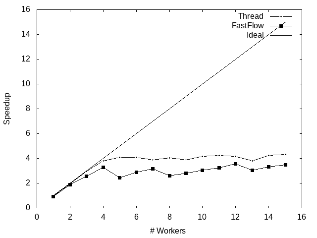
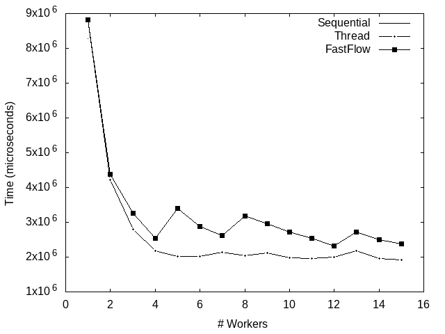
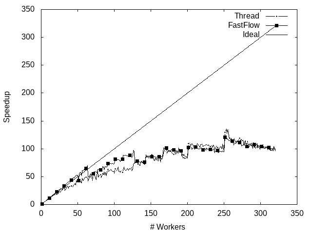

# GeneticAlgoritmTSP

# TSP with Genetic Algorithms
The purpose of the project was to solve [Travelling Salesman Problem](https://en.wikipedia.org/wiki/Travelling_salesman_problem), known as *TSP*, by using a [Genetic Algorithms](https://ibug.doc.ic.ac.uk/media/uploads/documents/courses/GeneticAlgorithm-tutorial.pdf) approach and exploit parallelism. In addition to the sequential version used as a baseline, two parallel versions were developed, one using standard C++ threads and one using [Fastflow](https://github.com/fastflow/fastflow#fastflow-high-performance-parallel-patterns-and-building-blocks-in-c). More information about the project and the design of the parallel versions can be found in the [report](https://github.com/FraCorti/TSP-GeneticAlgorithm/blob/master/report.pdf).

To test the correctness of the three versions developed, I saved for a run of each version the current best route for each generation of the algorithm. In the following plots the length of the best path decrease as the algorithm goes on with the generation, so convergence algorithms were obtained. 


  


## Running the project
The project can be compiled and executed using [Cmake 3.11](https://cmake.org/) or [GCC](https://gcc.gnu.org/) (remember to turn on -O3 optimization). 

**To compile**
 ```bash

  $ make compile
  ```

**To execute**
```bash
- sequential version: ./demo 0 #NODES #POPULATION 0 #ITERATIONS
- thread version: ./demo 1 #NODES #POPULATION 1 #ITERATIONS
- fastflow version: ./demo 2 #NODES #POPLATION 2 #ITERATIONS

```

**To execute graphical version** (NOTE: you have to install the graphics.h library)
```bash
$ make compile-graph
$ ./demo 0 #NODES #POPULATION 0 #ITERATIONS
```

**To compile debug version**
```bash
$ make compile-debug
```

**To compile with inforation about vectorized loops**
```bash
$ make vectorized
```

**To test the application** (the parameters can be modified in the bash/test.sh file)
```bash
$ make test
```

**Example of usage**
```bash
- ./demo 1 20 1000 4 1000
```


## Results 
Each version of the program was tested on an Intel Xeon PHI machine from 1 to 256 thread. The tests were done with 10 generation and 20000 chromosomes and considering [500, 1000, 2000] nodes in the graph.<br/><br/>
 

## Acknowledgments
This project was developed for the course of [Parallel and Distributed Systems](http://didawiki.di.unipi.it/doku.php/magistraleinformaticanetworking/spm/sdpm09support) at the University of Pisa under the guide of [Prof. Marco Danelutto](http://calvados.di.unipi.it/paragroup/danelutto/) and [Prof. Patrizio Dazzi](http://pages.di.unipi.it/dazzi/).
